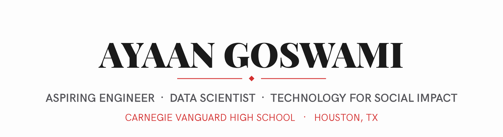

<!--
  Profile README for @JaukG9
  Banner typography: Playfair Display (display) + HK Grotesk (body) — both SIL OFL, rendered into PNG via assets/gen_banner.py
  Theme-aware via <picture> + prefers-color-scheme. Accent: #d32f2f
-->

<picture>
  <source media="(prefers-color-scheme: dark)" srcset="./assets/hero-dark.png">
  
</picture>

  
  &ensp;
  
  &ensp;
  
  &ensp;
  

I build at the intersection of machine learning, full-stack development, and robotics — from NLP models that triage mental health text, to autonomous VEX robots, to competitive AI for Pokémon Showdown. I care about tech that has real-world, social-impact applications, and I like taking projects from a rough idea all the way to something deployed and working.

  
  
  
  
  
  
  
  
  
  

---

### Machine Learning & Research

- **[mental-health-sentiment-analysis](https://github.com/JaukG9/mental-health-sentiment-analysis):** hybrid BERT + Random Forest pipeline for automated mental health text triage (~85% accuracy), deployed on Hugging Face Spaces with a GitHub Pages frontend; basis for a paper submitted to IJHSR
- **[voice-health](https://github.com/JaukG9/voice-health):** XGBoost model on the UCI Parkinson's voice dataset, with SHAP for interpreting vocal biomarkers
- **[Parkinsons-Arduino](https://github.com/JaukG9/Parkinsons-Arduino):** Arduino-based hardware companion for Parkinson's-related signal sensing
- **[PokeNet](https://github.com/JaukG9/PokeNet):** supervised imitation-learning AI for competitive Pokémon Showdown (Gen 9 OU) — a residual MLP trained on a 725-dimensional feature vector built from my own gameplay data, collected through a terminal proxy bot using poke-env

Also completed an ML research technical assessment (XGBoost + SHAP on the UCI Parkinson's voice dataset) as part of a university research lab application, and an AP Research paper on implicitness and adaptability in gamified educational environments, including statistical analysis of in-game metrics.

### VEX Robotics (Team 285C)

- **[Pushback-285C](https://github.com/JaukG9/Pushback-285C):** competition code for the Push Back season
- **[Override-285C](https://github.com/JaukG9/Override-285C):** competition code for the Override season

Beyond competition code, I've designed automatic motion-chaining parameter formulas for LemLib's `moveToPoint()` / `turnToHeading()`, incorporating kinematic stopping distance, trapezoidal/triangular motion profiles, and current robot speed as initial velocity.

### Full-Stack & Game Dev

- **[Project 1600](https://github.com/JaukG9/Project-1600):** full-stack SAT prep and academic mentoring platform (Next.js 15, Supabase, Tailwind CSS v4, Stripe) with mentor/student dashboards, courses, assignments, and messaging
- **[2DPlatformer-IAGE](https://github.com/JaukG9/2DPlatformer-IAGE):** an original 2D platformer game
- **[APUSH-Practice](https://github.com/JaukG9/APUSH-Practice):** a gamified AP US History practice site, tied to my AP Research work on implicitness and adaptability in gamified learning environments

---

### GitHub Stats

  
  

---

More at **[ayaangoswami.dev](https://ayaangoswami.dev)**

