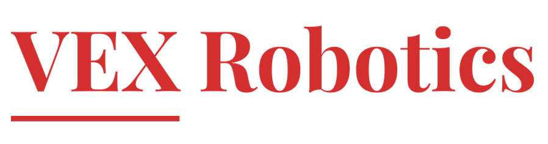
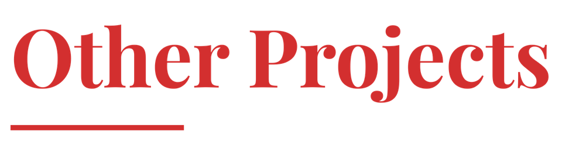
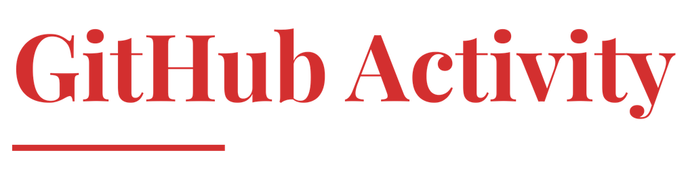

<!--
  Profile README for @JaukG9
  Typography: Playfair Display (display/headers) + HK Grotesk (body/tagline) — both SIL OFL
  All images (hero, headers, divider, bullet) are transparent PNGs so they sit correctly on
  GitHub's actual page background, light or dark, rather than carrying a baked-in fill color
  that only matches one theme. Regenerate anytime with assets/gen_banner.py and assets/gen_headers.py.
-->

<picture>
  <source media="(prefers-color-scheme: dark)" srcset="./assets/hero-dark.png">
  
</picture>

  
  &ensp;
  
  &ensp;
  
  &ensp;
  

 

<i>I like taking projects from a rough idea to something people can actually use, whether that is 
a model, a robot, or a web app. Most of what is here started as a question I was curious about: 
can an NLP pipeline triage mental health text well enough to matter, can a robot chain its own 
movements instead of stopping between points, can a model trained on my own games get better 
at Pokémon than I am.</i>

  

<strong>PYTHON</strong> &nbsp;·&nbsp; <strong>C++</strong> &nbsp;·&nbsp; <strong>JAVASCRIPT</strong> &nbsp;·&nbsp; <strong>TYPESCRIPT</strong> &nbsp;·&nbsp; <strong>NEXT.JS</strong> &nbsp;·&nbsp; <strong>REACT</strong> &nbsp;·&nbsp; <strong>PYTORCH</strong> &nbsp;·&nbsp; <strong>SUPABASE</strong> &nbsp;·&nbsp; <strong>ARDUINO</strong> &nbsp;·&nbsp; <strong>LATEX</strong>

  

 

&nbsp; <strong><a href="https://github.com/JaukG9/mental-health-sentiment-analysis">mental-health-sentiment-analysis</a></strong>: hybrid BERT and Random Forest pipeline for automated mental health text triage (about 85% accuracy), deployed on Hugging Face Spaces with a GitHub Pages frontend. The basis for a paper submitted to IJHSR. 
&nbsp; <strong><a href="https://github.com/JaukG9/voice-health">voice-health</a></strong>: XGBoost model on the UCI Parkinson's voice dataset, with SHAP for interpreting vocal biomarkers. 
&nbsp; <strong><a href="https://github.com/JaukG9/Parkinsons-Arduino">Parkinsons-Arduino</a></strong>: an Arduino-based hardware companion for Parkinson's-related signal sensing. 
&nbsp; <strong><a href="https://github.com/JaukG9/PokeNet">PokeNet</a></strong>: a supervised imitation-learning AI for competitive Pokémon Showdown (Gen 9 OU), built as a residual MLP trained on a 725-dimensional feature vector from my own gameplay data, collected through a terminal proxy bot using poke-env.

I also built an XGBoost and SHAP pipeline on the UCI Parkinson's voice dataset as a technical assessment for a university research lab application, and wrote an AP Research paper on implicitness and adaptability in gamified educational environments, with statistical analysis of the game metrics behind it.

I compete with VEX Robotics Team 285C.

&nbsp; <strong><a href="https://github.com/JaukG9/Pushback-285C">Pushback-285C</a></strong>: competition code for the Push Back season. 
&nbsp; <strong><a href="https://github.com/JaukG9/Override-285C">Override-285C</a></strong>: competition code for the Override season.

Outside competition code, I designed automatic motion-chaining formulas for LemLib's `moveToPoint()` and `turnToHeading()`, using kinematic stopping distance and trapezoidal or triangular motion profiles so the robot carries its current speed into the next movement instead of stopping and restarting between points.

&nbsp; <strong><a href="https://github.com/JaukG9/Project-1600">Project 1600</a></strong>: a full-stack SAT prep and mentoring platform built with Next.js and Supabase. 
&nbsp; <strong><a href="https://github.com/JaukG9/2DPlatformer-IAGE">2DPlatformer-IAGE</a></strong>: an original 2D platformer game. 
&nbsp; <strong><a href="https://github.com/JaukG9/APUSH-Practice">APUSH-Practice</a></strong>: a gamified AP US History practice site.

&nbsp; <strong>Research paper</strong>: wrote a paper on a hybrid BERT and Random Forest pipeline for mental health text triage, submitted to the International Journal of High School Research (IJHSR). 
&nbsp; <strong>Rice University</strong>: completed a research program at Rice University. 
&nbsp; <strong>Research lab technical assessment</strong>: built an XGBoost and SHAP pipeline on the UCI Parkinson's voice dataset as part of a university research lab application. 
&nbsp; <strong>AP Research</strong>: independent paper on implicitness and adaptability in gamified educational environments, including original statistical analysis of in-game metrics. 
&nbsp; <strong>VEX Robotics</strong>: ongoing competitor with Team 285C.

  

<picture>
  <source media="(prefers-color-scheme: dark)" srcset="https://raw.githubusercontent.com/JaukG9/JaukG9/output/snake-dark.svg">
  
</picture>

  

  

<picture>
  <source media="(prefers-color-scheme: dark)" srcset="./profile/stats-dark.svg">
  
</picture>
<picture>
  <source media="(prefers-color-scheme: dark)" srcset="./profile/top-langs-dark.svg">
  
</picture>

  

  

This updates as projects wrap up or new ones start. The repos are the source of truth.

  

More at <a href="https://ayaangoswami.dev"><strong>ayaangoswami.dev</strong></a>

